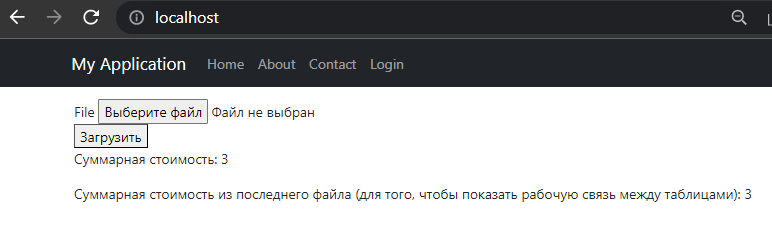
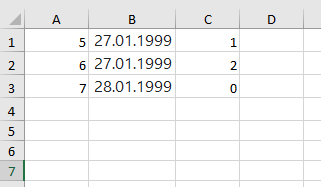

#Подсчет стоимости из различных XLSX-файлов на Yii2

### Задание:
1) Необходимо развернуть Yii2 фреймворк
2) Сделать форму загрузки XLSX файла (три колонки "номер, дата, стоимость")
3) Данные из файла необходимо загрузить в базу данных.
4) Если номер из строки уже добавлен в таблицу, то необходимо отредактировать строку в таблице, иначе добавить новую запись.
5) Необходимо посчитать сумму по колонке "стоимость"
6) Необходимо создать таблицу с загруженными файлами, и таблицу с данными по загруженным файлам.
7) Реализовать связь между этими двумя таблицами.

### Инструкция по запуску:
0. Убедитесь, что у Вас установлен git, docker и docker-compose (предполагается, что проект запускается в linux)
1. Скопируйте проект при помощи команды: `git clone https://github.com/Hnakra/Yii2_XLSX.git`
2. Перейдите в папку проекта: `cd Yii2_XLSX/basic`
3. Выполните команду: `docker-compose up -d --build`
4. После того как оба контейнера запустятся, необходимо выполнить следующую команду: 
`docker exec -it yii2_xlsx bash -c "composer install && php yii migrate"`. Обязательно напишите `yes`, когда программа запросит подтверждение на миграцию.
5. Далее, необходимо дать доступ на перезапись к некоторым папкам. Делается это при помощи команды
`sudo chmod 777 -R web/assets/ && sudo chmod 777 -R web/uploads/`
6. Запустите сайт в браузере по адресу `localhost`

Должен открыться сайт со следующим содержимым:

### Использование
Программа считает сумму поля стоимости из всех файлов, что были отправлены через форму при помощи кнопки **загрузить**.
Любой отправляемый файл должен соответствовать следующим условиям:
1. Он должен быть формата .xlsx (проще всего создать его в Microsoft Excel)
2. Должен иметь следующую структуру:

   
   Колонка A - номер записи
   Колонка B - дата записи
   Колонка C - значение записи (стоимость)

Для того чтобы практически применить связь типа `many-to-many` между таблицами files и transactions, был реализован подсчет суммарной стоимости из последнего файла